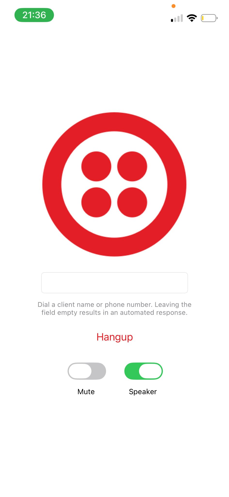

# VoiceQuickstart (SwiftUI)

This project is a direct SwiftUI port of Twilio's official Voice iOS Quickstart sample, adapting the original sample from UIKit to SwiftUI patterns while re-implementing the core capabilities (setting up the Voice SDK, registering for VoIP push notifications, and placing/receiving calls) in a SwiftUI-friendly architecture.

- Original Twilio sample (UIKit): https://github.com/twilio/voice-quickstart-ios
- Voice iOS SDK Getting Started: https://www.twilio.com/docs/voice/sdks/ios/get-started#quickstart

## Requirements
- iOS 18.6
- Xcode 26.0
- Swift 6.2
- A physical iOS device (VoIP push notifications and audio features require real hardware)
- Active Twilio account with Voice configured

## What’s included
- SwiftUI app structure (`@main` app, views, and state management)
- Integration points for Twilio Voice SDK setup
- VoIP push registration scaffolding
- Example call UI in SwiftUI

## Getting started
1. Follow the Twilio Voice iOS SDK Getting Started guide to configure your Twilio project and generate access/capability tokens.
2. Add your Twilio access token to the app:
   - Open `VoiceQuickStartApp.swift`
   - Update the `accessToken` property:
```swift
     private let accessToken: String = "YOUR_TWILIO_ACCESS_TOKEN"
```
3. Run on a real device for VoIP push and audio features.



## Notes
- This project is intended for educational purposes and as a starting point for integrating Twilio Voice in a SwiftUI-based app.
- Refer to Twilio’s documentation for the most up-to-date setup steps, capability token generation, and production best practices.

## License
Code in this repository is available under the MIT License. Note that use of the Twilio Voice SDK is subject to Twilio's terms.".

